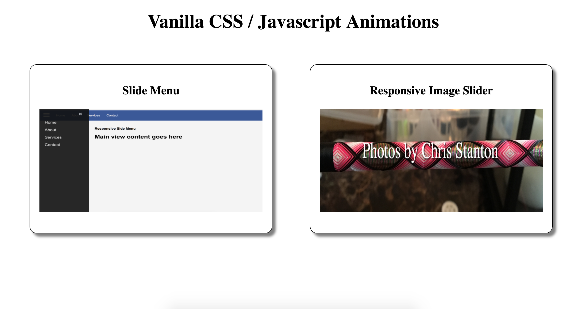
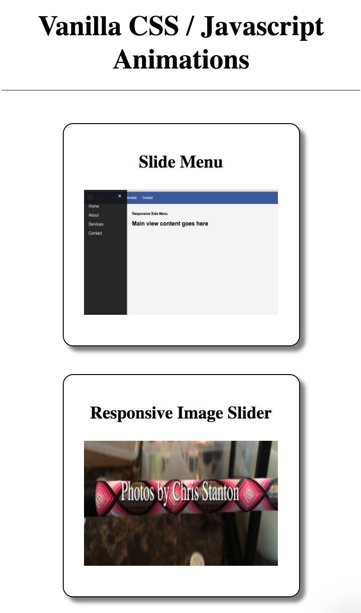
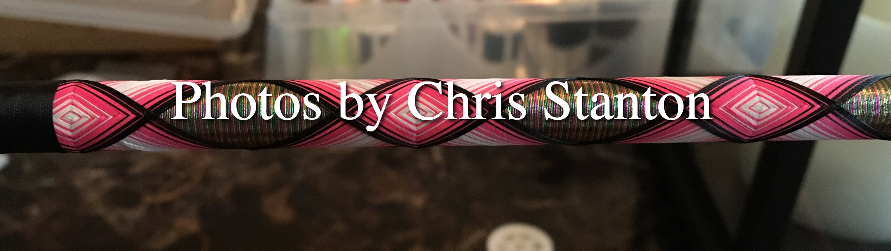
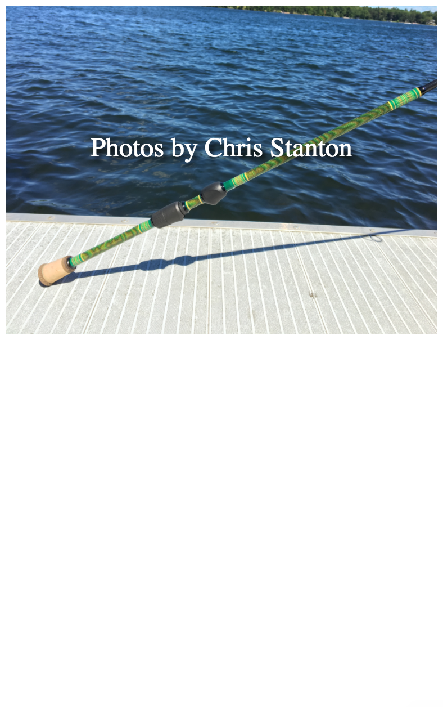
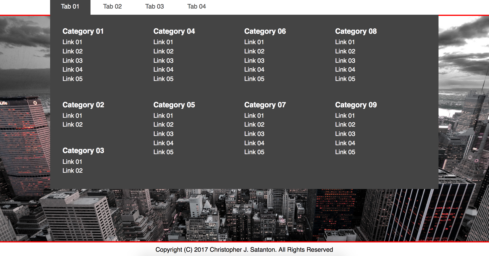
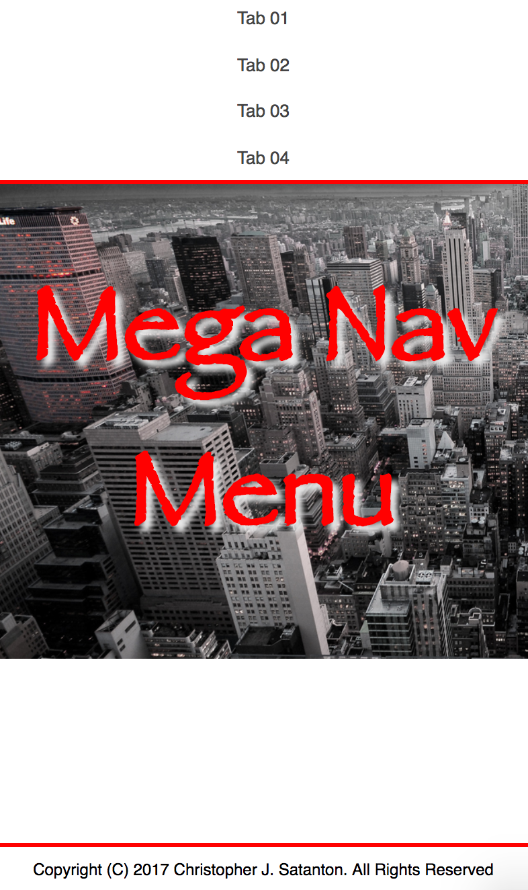
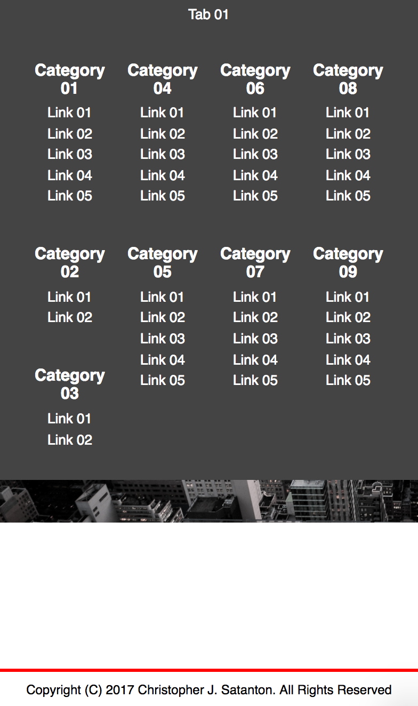

# Vanilla Javascript / CSS Animations

###### *Entire Working Library can be viewed on Heroku here:* [vanilla-animations.herokuapp.com](https://vanilla-animations.herokuapp.com)

---
## Main Landing View
###### Land page displays cards for all code examples that link to the specific working project.  All project us Flex Box and follow ES6, HTML5 and CSS3 standards.  There are no plugins or other 3rd party libraries in any of the projects. ONLY vanilla Javascript!!!

- *Desktop View*

  

- *Mobile View*

  

---

### Slide Menu

###### Slide Menu is a mobile friendly nav bar with slide out icon (slides in from left). Browser needs to support HTML5 and CSS3 elements. Slide menu is mobile friendly and follows HTML5, CSS3, ES6 and Flex Box standards.

- *Desktop View*

  

- *Side Menu*

  

- *Mobile View*

  

<!-- ###### *Working code can be viewed on Heroku here:* [Slide Menu](https://vanilla-animations.herokuapp.com/slidemenu/index.html) -->

---

### Responsive Image Slider

###### Container that uses ES6 transitions to fade images in and out.  There is also CSS code images to slide in and out instead of fading. Image slider is mobile friendly and follows HTML5, CSS3, ES6 and Flex Box standards.

- *Desktop View*

  

- *Mobile View*

  

---

### Mega Nav Menu

###### Nav bar that contains multiple links, text or pictures.  Nav bar is mobile friendly and follows HTML5, CSS3, ES6 and Flex Box standards.

- *Desktop View*

  

- *Desktop Nav Menu*

  

- *Mobile View*

  

- *Mobile Nav Menu*

  

---
