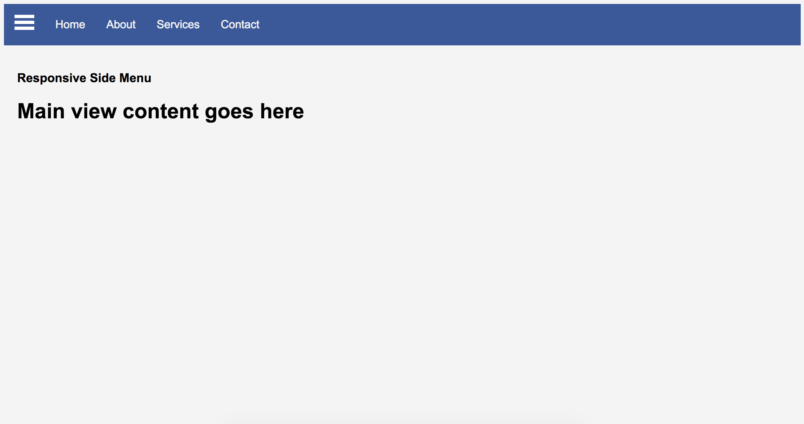
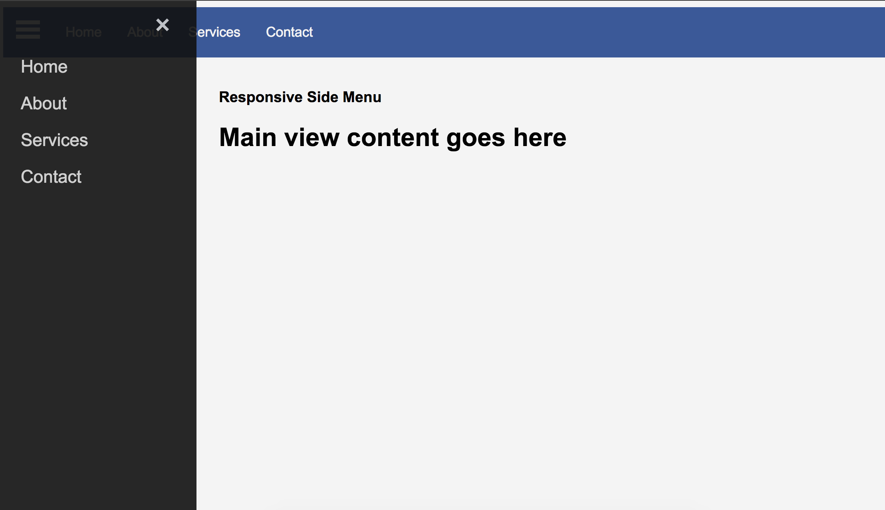

# Vanilla Javascript / CSS Animations

---

### Slide Menu

###### Slide Menu is a mobile friendly nav bar with slide out icon (slides in from left). Browser needs to support HTML5 and CSS3 elements.

- Desktop View

- Side Menu

- Mobile View

---
