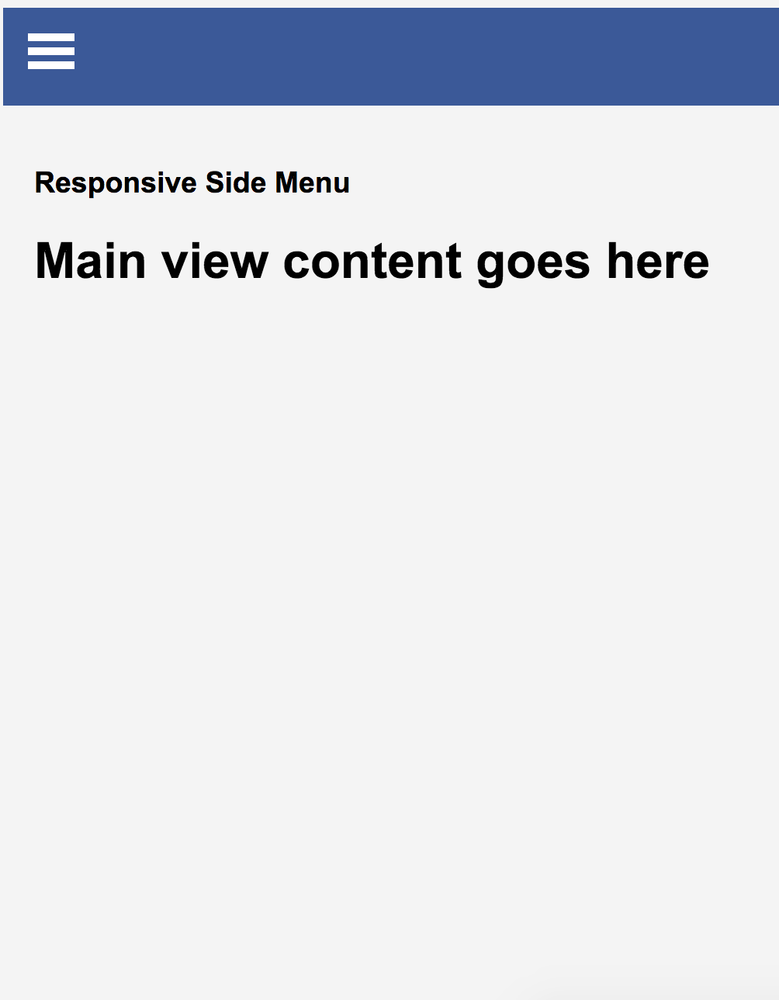

# Vanilla Javascript / CSS Animations

###### *Entire Working Library can be viewed on Heroku here:* [vanilla-animations.herokuapp.com](https://vanilla-animations.herokuapp.com)

---

### Slide Menu

###### Slide Menu is a mobile friendly nav bar with slide out icon (slides in from left). Browser needs to support HTML5 and CSS3 elements.

- *Desktop View*

  

- *Side Menu*

  

- *Mobile View*

  

###### *Working code can be viewed on Heroku here:* [Slide Menu](https://vanilla-animations.herokuapp.com/slidemenu/index.html)

---
