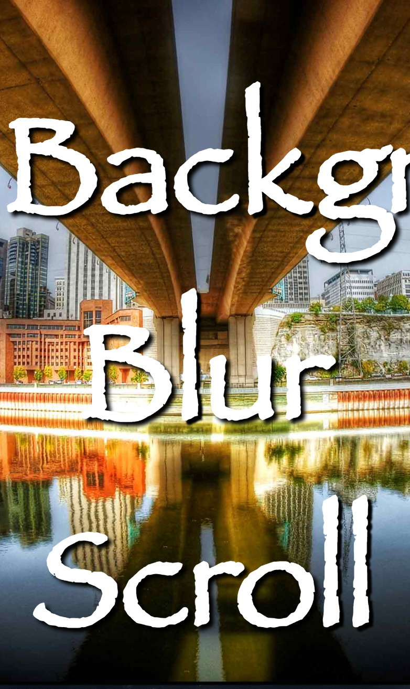

# Vanilla Javascript / CSS Animations

### Description:
##### All projects are both desktop, mobile friendly and include ONLY HTML, CSS and Javascript.

###### *Entire Working Library can be viewed on Heroku here:* [vanilla-animations.herokuapp.com](https://vanilla-animations.herokuapp.com)

---
## Main Landing View

###### Land page displays cards for all code examples that link to the specific working project.  All project us Flex Box and follow ES6, HTML5 and CSS3 standards.  There are no plugins or other 3rd party libraries in any of the projects. ONLY vanilla Javascript!!!

- *Desktop View*

  

- *Mobile View*

  

---

### Slide Menu

###### Slide Menu is a mobile friendly nav bar with slide out icon (slides in from left). Browser needs to support HTML5 and CSS3 elements. Slide menu is mobile friendly and follows HTML5, CSS3, ES6 and Flex Box standards.

- *Desktop View*

  

- *Desktop Side Menu*

  

- *Mobile View*

  

- *Mobile Side Menu*

  

<!-- ###### *Working code can be viewed on Heroku here:* [Slide Menu](https://vanilla-animations.herokuapp.com/slidemenu/index.html) -->

---

### Responsive Image Slider

###### Container that uses ES6 transitions to fade images in and out.  There is also CSS code images to slide in and out instead of fading. Image slider is mobile friendly and follows HTML5, CSS3, ES6 and Flex Box standards.

- *Desktop View*

  

- *Mobile View*

  

---

### Mega Nav Menu

###### Nav bar that contains multiple links, text or pictures.  Nav bar is mobile friendly and follows HTML5, CSS3, ES6 and Flex Box standards.

- *Desktop View*

  

- *Desktop Nav Menu*

  

- *Mobile View*

  

- *Mobile Nav Menu*

  

---

### Modern Nav Menu

###### Modern nav menu is built from HTML and CSS only.  Boilerplate includes hover over links to expand and each "option" is color coded.  This boilerplate is only desktop responsive.

- *Desktop Views*

  

  

---

### Background Pulse Animation

###### Background full screen color transformation. Background colors transform to new colors every 10 seconds.  Colors are preset in ``styles.css`` file where they can be changed to any colors. Project uses HTML5 and CSS3.

- *Desktop View*

  

  ---

### Background Icon Animation

###### Full screen Background icon animation. Background icons float from bottom of screen to the top at different speeds. Project uses HTML5 and CSS3.

- *Desktop View*

  

  ---

### Background Blur Scroll

###### Responsive background transition between two images that creates a "blur" like effect. The transition happens on scroll.  Image transitions from normal to a blurred effect. Project uses HTML5 and CSS3.

- *Desktop Views*

  

  

- *Mobile Views*

  

  
